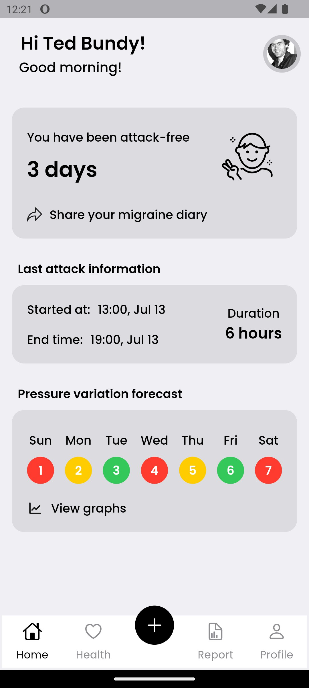
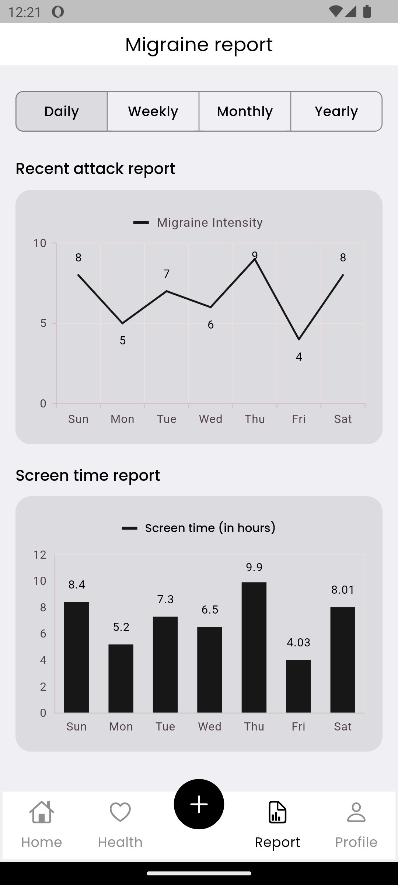
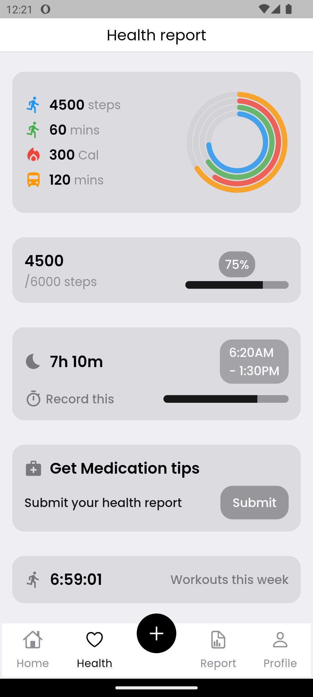

# Migraine Tracker

## Project Overview
The Migraine Tracker is a sophisticated mobile application designed to empower individuals experiencing migraines through effective tracking and management of their symptoms. By leveraging health data science methodologies, this application aims to provide users with valuable insights into their migraine patterns, potential triggers, and treatment efficacy, thereby enhancing overall quality of life.

    
    
    
    

## Key Features
- **Symptom Tracking:** Users can log detailed information regarding the frequency, duration, and intensity of their migraines, as well as associated symptoms, facilitating comprehensive self-monitoring.
- **Trigger Identification:** The application allows users to identify and categorize potential migraine triggers, including dietary factors, environmental conditions, and lifestyle choices, thereby promoting informed decision-making.
- **Data Visualization:** Intuitive visual representations of tracked data enable users to discern patterns and trends over time, enhancing the ability to correlate triggers with migraine episodes.
- **Personalized Insights:** Utilizing machine learning algorithms, the app provides tailored recommendations based on individual user data, fostering proactive management strategies.
- **Exportable Reports:** Users can generate detailed reports summarizing their migraine history, which can be shared with healthcare professionals to inform treatment decisions.

## Objectives
The primary objectives of the Migraine Tracker project encompass:
1. To develop a reliable and user-centric application that enables individuals to accurately monitor and manage their migraine experiences.
2. To integrate a variety of data inputs, including self-reported symptoms, environmental data, and treatment outcomes, for a holistic understanding of migraine dynamics.
3. To employ advanced analytics to identify significant correlations between recorded triggers and migraine occurrences, thereby facilitating personalized intervention strategies.
4. To enhance communication between users and healthcare providers by providing structured data that can inform clinical discussions and treatment planning.

## Methods
The Migraine Tracker project employs a systematic approach to data collection, preprocessing, and analysis, which includes the following methodologies:
- **Data Collection:** The application aggregates user-reported data alongside environmental and meteorological information, ensuring a comprehensive dataset for analysis.
- **Data Preprocessing:** Rigorous preprocessing techniques are applied to ensure data quality, including cleaning and standardizing entries to maintain consistency across user inputs.
- **Analytical Framework:** A suite of statistical and machine learning algorithms, such as logistic regression and neural networks, is implemented to analyze data and predict migraine occurrences based on identified patterns and triggers.
- **Performance Evaluation:** The predictive models are validated through metrics such as accuracy, precision, recall, and F1 score, ensuring the reliability of the insights generated by the application.

## User Interface
The user interface of the Migraine Tracker is designed to prioritize user experience, offering:
- **Simplified Data Entry:** An intuitive design that facilitates quick and easy logging of migraine-related data.
- **Interactive Dashboards:** Engaging visualizations that present data trends, enabling users to gain insights at a glance.
- **Customizable Alerts:** Features that allow users to set reminders for logging symptoms and medications, promoting adherence to tracking protocols.

## Acknowledgements
The Migraine Tracker project acknowledges the contributions of various stakeholders and organizations that have provided valuable resources and insights, including:
- **Neurology Clinics:** For sharing expertise in migraine management and insights into patient needs, ensuring the application meets clinical standards.
- **Health Data Researchers:** For their guidance in data analysis methodologies and best practices in the handling of health-related datasets.

## Public Health Relevance Statement
Migraine is a prevalent neurological disorder that significantly impacts individuals' quality of life, leading to considerable disability and economic burden. According to the World Health Organization, migraines affect an estimated 1 in 7 people globally, emphasizing the need for effective management strategies. The Migraine Tracker application addresses this public health challenge by enabling individuals to take an active role in managing their condition through self-monitoring and education.

In Bangladesh, the burden of migraine is particularly concerning, as many individuals remain undiagnosed or inadequately treated due to limited access to healthcare resources and insufficient awareness about the condition. The Migraine Tracker not only empowers users to monitor their symptoms and identify triggers but also serves as a crucial tool for collecting and analyzing data on migraine prevalence and patterns within the Bangladeshi population. This information can be invaluable for public health researchers and clinicians, informing community health strategies and prevention initiatives tailored to local needs.

By contributing to a larger body of knowledge on migraine patterns and triggers in Bangladesh, the application can inform targeted interventions aimed at reducing the incidence and impact of migraines. Furthermore, enhancing communication between patients and healthcare providers can lead to more personalized and effective treatment plans, ultimately improving health outcomes in affected populations and addressing a significant public health challenge in Bangladesh.

